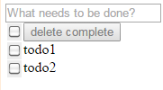

#ToDoMVC

Framkework ToDoMVC comparation 首篇。
+ ToDoMVC
 -  <u><strong>maria</strong></u>
 -  Backbone
 -  Knockout
 -  AngularJS
 -  vanlillajs

##maria
<div style='text-align:center'>

*
引图 - 这里就不重复叙述了
深入可阅读
[scaling-isomorphic-javascript-code](http://blog.nodejitsu.com/scaling-isomorphic-javascript-code/)
*
</div>

#####index.html
```js
<html>
<link rel="stylesheet" href="bower_components/todomvc-common/base.css"/>
<!--
//lots of scripts loaded
-->
<script>
	maria.on(window, 'load', function() {
    	var model = new checkit.TodosModel();
    	var view = new checkit.TodosAppView(model);
    	document.body.appendChild(view.build());
});
</script>
</html>
```
从上图得知Model层在被修改后Fires Events 传递给view层。 
所以在`index.html`中有了这段代码
```js 
var view=new checkit.TodosAppView(model);//view 监听model的修改
```
这里采用了 pub/sub模式(发布-订阅)，多个view可以监听相同的model，model的修改会同时推送给所有订阅它的views。

上图显示了 我修改了todoModel的_done属性，同时推送给view和view2。

重新回到`index.html`中的这段代码中，我发现没有生成todosController和关联view和controller，这令我刚开始十分困惑，后来想到controller应该是默认从命名关联的。于是我翻了下源码，
```js
maria.View.prototype.getController = function() {
    if (!this._controller) {
    	//这里如果发现view没有关联controller，尝试关联默认的controller
        this.setController(this.getDefaultController());
    }
    return this._controller;
};

maria.View.subclass = function(namespace, name, options) {
	//...
    // 默认的controller和view是相同的前缀
    var controllerConstructorName = options.controllerConstructorName || name.replace(/(View|)$/, 'Controller');
    //...
    if (!Object.prototype.hasOwnProperty.call(properties, 'getDefaultControllerConstructor')) {
        properties.getDefaultControllerConstructor = function() {
             //返回view对应的默认controller构造函数
             //后续代码会new一个controller出来
            return controllerConstructor || namespace[controllerConstructorName];
        };
    }
    //...
};
```
下面随遍找了一个view层的代码。
#####TodosInputView.js
```js
maria.ElementView.subclass(checkit, 'TodosInputView', {
    uiActions: {
        'keyup    .content': 'onKeyupInput'   ,
        'keypress .content': 'onKeypressInput'
    },
    properties: {
        getInputValue: function() {
            return this.find('.content').value;
        },
        clearInput: function() {
            this.find('.content').value = '';
        }
    }
});
```
上面代码中的
```js
uiActions{
	//controller层有队以ing的onKeyupInput方法
	'keyup    .content': 'onKeyupInput',
	'keypress .content': 'onKeypressInput'
}
```
对应了第一图的View -> Controller (pass call),view委托DOM事件给controller，并暴露出一些接口供controller调用。 
```js
 properties: {
 		//下面的接口会在controller层里调用
        getInputValue: function() {
            return this.find('.content').value;
        },
        clearInput: function() {
            this.find('.content').value = '';
        }
    }
```
贴上对应的controller层代码
#####TodosInputController.js
```js
maria.Controller.subclass(checkit, 'TodosInputController', {
    properties: {
        onKeyupInput: function() {//...},
        onKeypressInput: function(evt) {
            if (evt.keyCode == 13) {
                var view = this.getView();
                var value = view.getInputValue();
                if (!checkit.isBlank(value)) {
                    var todo = new checkit.TodoModel();
                    todo.setContent(value);
                    this.getModel().add(todo);
                    view.clearInput();
                }
            }
        }
    }
});
```
从上面的代码可以看出，controller处理view层传递过来的event，但没有主动监听DOM事件（view层自己监听）。仔细看onKeypressInput方法:
```js
if (evt.keyCode == 13) {
	var view = this.getView();
	var value = view.getInputValue();//从view层暴露的接口检测
	if (!checkit.isBlank(value)) {
    	//生成新的model并添加到model集合里
		var todo = new checkit.TodoModel();
		todo.setContent(value);
		this.getModel().add(todo);//这里有疑点
		view.clearInput();//通过view的接口修改view的显示
    }
```
controller层的代码显示了controller只负责业务逻辑处理，并不负责DOM事件监听和DOM元素修改。(Append,delete and etc)
不过这里我有个疑点`this.getModel().add(todo);`执行这段代码后，并会添加上一个todo标签。
 <span style='vertical-align:middle;font-size:24px'>-></span> 
然而我在对应的model代码中并没有发现add的方法，猜测是内置函数。于是在maria源码中翻到下面一段
```js
//类似的方法还有maria.SetModel.protoype.delete
maria.SetModel.prototype.add = function() {
    var added = [];
    for (var i = 0, ilen = arguments.length; i < ilen; i++) {
        var argument = arguments[i];
        if (hormigas.ObjectSet.prototype.add.call(this, argument)) {
            added.push(argument);
            //...省略了大量伪事件委托和监听
        }
    }
    var modified = added.length > 0;
    if (modified) {
        this.dispatchEvent({type: 'change', addedTargets: added, deletedTargets[]});
    }
    return modified;
};
```
其中这一段
```js
if (modified) {
	//model集合在修改后发布对应的时间给订阅它view层
	this.dispatchEvent({type: 'change', addedTargets: added, deletedTargets[]});
}
```
对应了最开始的`var view = new checkit.TodosAppView(model);`建立的pub/sub模型。然后我的疑惑点还是没有消除，model是否也参与DOM的crud？答案当然是：没有！！我又翻到了view的一段源码
```js
//类似的方法还有maria.SetView.prototype.handleAdd
maria.SetView.prototype.handleDelete = function(evt) {
    var childModels = evt.deletedTargets;
    for (var i = 0, ilen = childModels.length; i < ilen; i++) {
        var childModel = childModels[i];
        var childViews = this.childNodes;
        for (var j = 0, jlen = childViews.length; j < jlen; j++) {
            var childView = childViews[j];
            if (childView.getModel() === childModel) {
                this.removeChild(childView);
                childView.destroy();
                break;
            }
        }
    }
};
```
上面的代码显示了DOM的remove操作，整合了下model的代码，可以看出model层的任务包括了数据模型的crub而DOM的crub有view自己操作，不过是由model派发的指令决定具体操作。

